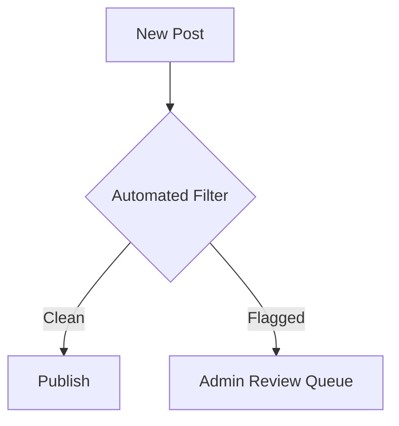

### **Community App: System Blueprint**  
**Core Objective**: A Meteor-based platform for faith communities with user engagement, events, and real-time communication.

---

#### **1. User Management System**  
**Components**:  
* **Authentication Gateway**  
  - Email/password + social logins  
  - Role-based access (Member/Admin)  
  - Session management  

**Workflow**:  
1. User registers → Profile auto-created  
2. Admin approves/modifies roles in dashboard  
3. Password recovery via email tokens  

**Tools**:  
* `accounts-password` + `accounts-ui` packages  
* Custom profile schema in MongoDB  

---

#### **2. Admin Control Panel**  
**Modules**:  
* **Event Manager**  
  - CRUD operations for events  
  - Calendar integration  
* **Content Moderator**  
  - Approve/remove posts  
  - User suspension interface  

**Data Flow**:  
* Admin actions → Meteor Methods → DB updates → UI sync  

---

#### **3. Real-Time Interaction Layer**  
**Features**:  
| Feature          | Protocol          | Data Structure          |  
|------------------|-------------------|-------------------------|  
| Global Chat      | Meteor Pub/Sub    | Messages collection     |  
| Private Messages | Filtered Pub/Sub  | Threads collection      |  
| Notifications    | DDP + Webhooks    | Notifications collection|  


#### **4. Event Ecosystem**  
**Pipeline**:  
1. Admin creates event → Stored in `Events` collection  
2. Users RSVP → Status recorded in nested array  
3. Reminders triggered via cron jobs  

**UI Requirements**:  
* Calendar view (FullCalendar.js integration)  
* Responsive cards with Tailwind  

---

#### **5. Community Forum**  
**Taxonomy**:  
* Categories → Subforums → Threads → Posts  
* Voting/ranking system for content  

**Moderation Flow**:  


---

#### **Optional Modules**  
* **Live Streaming**: JW Player or YouTube API  
* **Donations**: Stripe/PayPal webhooks  
* **Badges**: Role-based achievement system  

---

#### **Infrastructure Map**  
```plaintext
Client (Blaze/React)  
  │  
  ├── Meteor Methods → Server  
  │       │  
  │       └── MongoDB (Collections: Users, Events, Messages)  
  │  
  └── Tailwind CSS ↔ Design Tokens  
```

---

#### **Contributor Guidelines**  
**Workflow**:  
   - Feature branches → PRs → Test in staging  
   - UI-first development with Tailwind prototypes  
**Conventions**:  
   - Collection names in PascalCase (`Events`)  
   - Method names in `feature.action` format (`events.create`)  

---

