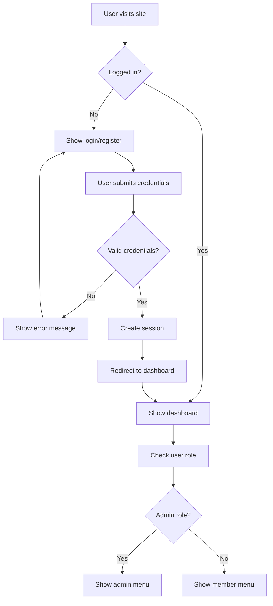
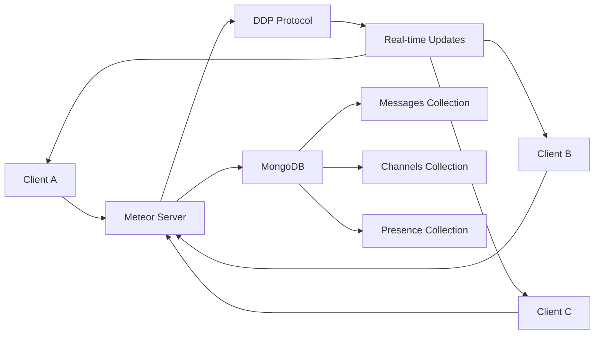
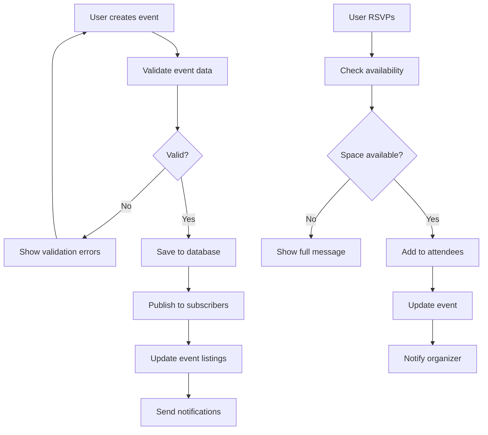
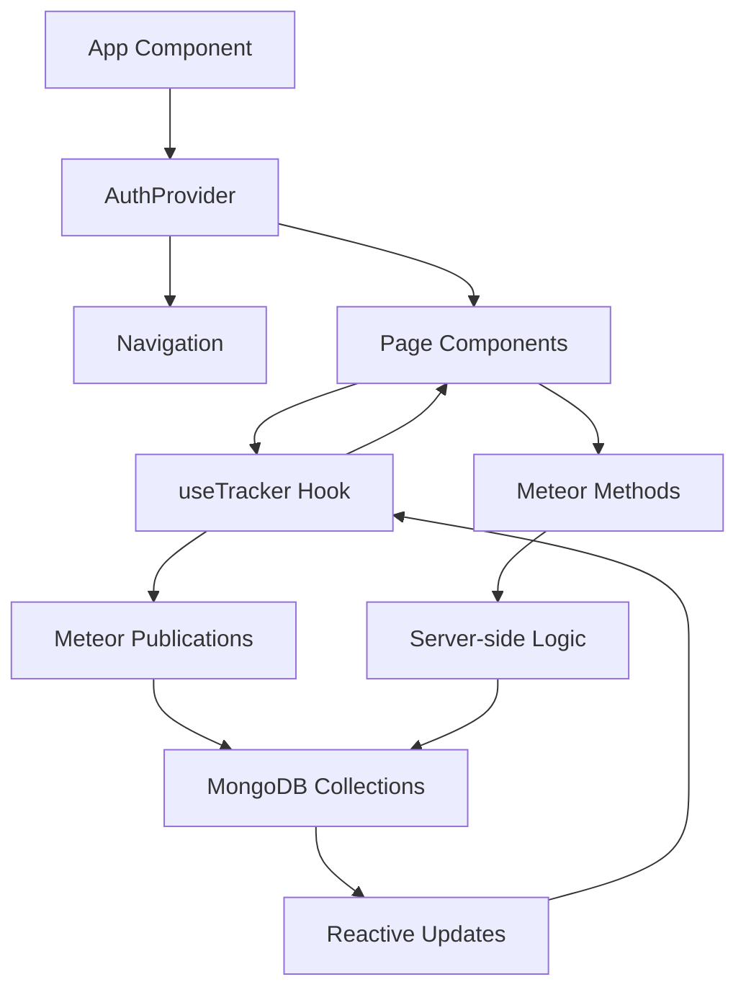
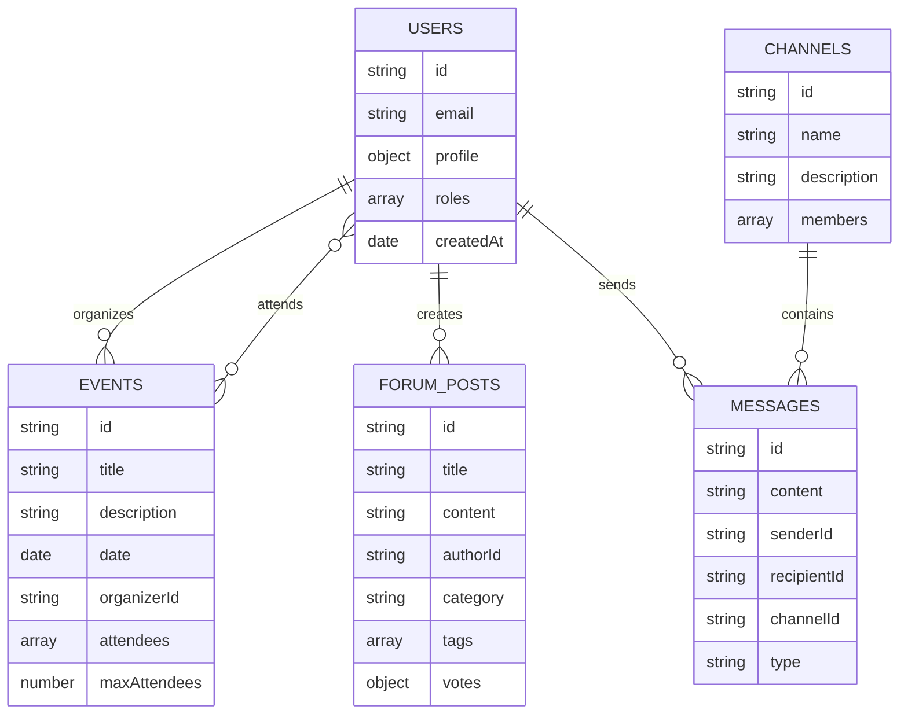

I'll create a comprehensive README.md file with all the documentation for you to download.

```markdown
# CommunityHub - Meteor Community Web App

## Table of Contents
1. [Project Overview](#project-overview)
2. [UI Components & Page Layout Breakdown](#ui-components--page-layout-breakdown)
3. [Architecture & Design Principles](#architecture--design-principles)
4. [Step-by-Step Implementation Plan](#step-by-step-implementation-plan)
5. [Phased Project Roadmap](#phased-project-roadmap)
6. [Flow Diagrams & Architecture](#flow-diagrams--architecture)
7. [Best Practices & Scalability](#best-practices--scalability)

## Project Overview

CommunityHub is a modern, full-stack community platform built with Meteor.js and React. It provides real-time chat, event management, forum discussions, and comprehensive user management with role-based access control.

### Key Features
- **Authentication System** with social login support
- **Role-based Access Control** (Admin/Member)
- **Real-time Chat** with channels and direct messaging
- **Event Management** with RSVP functionality
- **Forum Discussions** with voting and moderation
- **Admin Dashboard** for platform management
- **Responsive Design** with warm color palette

### Tech Stack
- **Frontend**: React 18, Next.js 15, TypeScript
- **Styling**: Tailwind CSS, shadcn/ui components
- **Backend**: Meteor.js (for real-time features)
- **Database**: MongoDB (Meteor's default)
- **Authentication**: Meteor Accounts
- **Real-time**: Meteor's DDP (Distributed Data Protocol)

---

## UI Components & Page Layout Breakdown

### 1. Navigation Component (`components/navigation.jsx`)

**Purpose**: Primary navigation bar with user authentication and role-based menu items.

**Structure**:
```jsx
<nav>
  <div className="logo-section">
    <Link to="/">CommunityHub Logo</Link>
  </div>
  
  <div className="desktop-navigation">
    {navigationItems.map(item => <NavLink />)}
    {user?.role === 'admin' && <AdminNavLink />}
  </div>
  
  <div className="user-section">
    {user ? <UserMenu /> : <AuthButtons />}
    <NotificationDropdown />
  </div>
  
  <div className="mobile-menu">
    <MobileNavigation />
  </div>
</nav>
```

**Key Elements**:
- **Logo & Branding**: Gradient logo with "CH" initials
- **Navigation Links**: Home, Events, Forums, Chat
- **User Menu**: Profile, settings, logout with avatar
- **Notifications**: Bell icon with unread count badge
- **Admin Access**: Conditional admin menu for privileged users
- **Mobile Responsive**: Hamburger menu for smaller screens

### 2. Home Page (`app/page.jsx`)

**Purpose**: Landing page showcasing platform features and encouraging user registration.

**Structure**:
```jsx
<div className="home-page">
  <section className="hero-section">
    <h1>Welcome to CommunityHub</h1>
    <p>Platform description</p>
    <div className="cta-buttons">
      <Button>Get Started</Button>
      <Button variant="outline">Join Community</Button>
    </div>
  </section>
  
  <section className="features-grid">
    {features.map(feature => <FeatureCard />)}
  </section>
  
  <section className="stats-section">
    {stats.map(stat => <StatCard />)}
  </section>
</div>
```

**Key Elements**:
- **Hero Section**: Gradient background with compelling headline
- **Feature Cards**: 6 cards highlighting key platform capabilities
- **Statistics**: User count, communities, messages, uptime metrics
- **Call-to-Action**: Prominent buttons for registration/login

### 3. Dashboard Page (`app/dashboard/page.jsx`)

**Purpose**: Personalized user dashboard showing activity, events, and quick actions.

**Structure**:
```jsx
<div className="dashboard">
  <header className="welcome-header">
    <h1>Welcome back, {user.name}!</h1>
  </header>
  
  <div className="stats-grid">
    {userStats.map(stat => <StatCard />)}
  </div>
  
  <div className="main-content">
    <div className="upcoming-events">
      <EventsList />
    </div>
    
    <div className="sidebar">
      <RecentActivity />
      <QuickActions />
    </div>
  </div>
</div>
```

**Key Elements**:
- **Personal Stats**: Events attended, forum posts, connections, reputation
- **Upcoming Events**: RSVP-enabled event cards with details
- **Recent Activity**: Community activity feed
- **Quick Actions**: Shortcuts to create events, posts, join chat

### 4. Admin Dashboard (`app/admin/page.jsx`)

**Purpose**: Administrative interface for platform management and moderation.

**Structure**:
```jsx
<div className="admin-dashboard">
  <header className="admin-header">
    <Shield icon />
    <h1>Admin Dashboard</h1>
  </header>
  
  <div className="admin-stats">
    {adminStats.map(stat => <AdminStatCard />)}
  </div>
  
  <div className="management-sections">
    <div className="user-management">
      <RecentUsers />
    </div>
    
    <div className="content-moderation">
      <PendingReports />
    </div>
  </div>
  
  <div className="quick-actions">
    <AdminActionGrid />
  </div>
</div>
```

**Key Elements**:
- **Admin Statistics**: Total users, active events, forum posts, reports
- **User Management**: Recent registrations with approval/rejection
- **Content Moderation**: Pending reports with severity levels
- **Quick Actions**: Grid of common administrative tasks

### 5. Events Page (`app/events/page.jsx`)

**Purpose**: Event discovery and management interface with filtering and RSVP functionality.

**Structure**:
```jsx
<div className="events-page">
  <header className="events-header">
    <h1>Events</h1>
    <Button>Create Event</Button>
  </header>
  
  <div className="filters-section">
    <SearchInput />
    <CategoryFilters />
  </div>
  
  <section className="featured-events">
    {featuredEvents.map(event => <FeaturedEventCard />)}
  </section>
  
  <section className="all-events">
    <EventGrid />
  </section>
</div>
```

**Key Elements**:
- **Search & Filters**: Real-time search with category filtering
- **Featured Events**: Highlighted events with star indicators
- **Event Cards**: Detailed cards with date, time, location, attendees
- **RSVP System**: Interactive attendance tracking
- **Event Types**: Color-coded badges (meeting, workshop, social)

### 6. Forums Page (`app/forums/page.jsx`)

**Purpose**: Discussion forum with categories, voting, and moderation features.

**Structure**:
```jsx
<div className="forums-page">
  <header className="forums-header">
    <h1>Community Forums</h1>
    <Button>New Post</Button>
  </header>
  
  <div className="forums-layout">
    <aside className="sidebar">
      <CategoryList />
      <ForumStats />
    </aside>
    
    <main className="posts-section">
      <SearchBar />
      <PostsList />
    </main>
  </div>
</div>
```

**Key Elements**:
- **Category Sidebar**: Filterable categories with post counts
- **Voting System**: Upvote/downvote arrows for posts
- **Post Metadata**: Author, timestamps, reply counts, views
- **Tags System**: Searchable tags for content organization
- **Pinned Posts**: Admin-highlighted important discussions

### 7. Chat Page (`app/chat/page.jsx`)

**Purpose**: Real-time chat interface with channels and user presence.

**Structure**:
```jsx
<div className="chat-page">
  <aside className="chat-sidebar">
    <div className="channels-section">
      <ChannelsList />
    </div>
    
    <div className="users-section">
      <OnlineUsers />
    </div>
  </aside>
  
  <main className="chat-main">
    <header className="chat-header">
      <ChannelInfo />
      <ChatActions />
    </header>
    
    <div className="messages-area">
      <MessagesList />
    </div>
    
    <footer className="message-input">
      <MessageComposer />
    </footer>
  </main>
</div>
```

**Key Elements**:
- **Channel Navigation**: Hashtag-prefixed channels with unread indicators
- **User Presence**: Online status indicators with colored dots
- **Message Threading**: Grouped messages by user with timestamps
- **Typing Indicators**: Real-time typing status
- **Message Composer**: Rich input with emoji and file attachment support

### 8. Messages Page (`app/messages/page.jsx`)

**Purpose**: Private messaging interface for direct user communication.

**Structure**:
```jsx
<div className="messages-page">
  <aside className="conversations-sidebar">
    <header className="messages-header">
      <h1>Messages</h1>
      <Button>New Message</Button>
    </header>
    
    <SearchInput />
    <ConversationsList />
  </aside>
  
  <main className="conversation-view">
    <header className="conversation-header">
      <UserInfo />
      <ConversationActions />
    </header>
    
    <div className="messages-container">
      <MessagesList />
    </div>
    
    <footer className="message-composer">
      <MessageInput />
    </footer>
  </main>
</div>
```

**Key Elements**:
- **Conversation List**: Searchable list with unread indicators
- **Message Bubbles**: Styled differently for sent/received messages
- **User Status**: Online/offline indicators
- **Message Actions**: Call, video call, info buttons
- **Real-time Updates**: Live message delivery and read receipts

### 9. Authentication Pages

#### Sign In (`app/auth/signin/page.jsx`)
```jsx
<div className="auth-page">
  <Card className="auth-card">
    <CardHeader>
      <h1>Welcome back</h1>
    </CardHeader>
    
    <CardContent>
      <SocialLoginButtons />
      <Separator />
      <EmailPasswordForm />
      <ForgotPasswordLink />
      <SignUpLink />
      <DemoCredentials />
    </CardContent>
  </Card>
</div>
```

#### Register (`app/auth/register/page.jsx`)
```jsx
<div className="auth-page">
  <Card className="auth-card">
    <CardHeader>
      <h1>Create account</h1>
    </CardHeader>
    
    <CardContent>
      <SocialLoginButtons />
      <Separator />
      <RegistrationForm />
      <TermsCheckbox />
      <SignInLink />
    </CardContent>
  </Card>
</div>
```

**Key Elements**:
- **Social Authentication**: GitHub and Google OAuth buttons
- **Form Validation**: Real-time validation with error messages
- **Password Visibility**: Toggle for password fields
- **Terms Agreement**: Required checkbox for registration
- **Demo Credentials**: Helpful for testing (admin/user accounts)

---

## Architecture & Design Principles

### 1. Component Hierarchy

```
App (Layout)
├── Navigation (Global)
├── AuthProvider (Context)
└── Pages
    ├── Home
    ├── Dashboard
    ├── Admin
    ├── Events
    ├── Forums
    ├── Chat
    ├── Messages
    └── Auth
        ├── SignIn
        └── Register
```

### 2. Atomic Design Approach

**Atoms** (Basic building blocks):
- Button, Input, Badge, Avatar
- Icons (Lucide React)
- Typography components

**Molecules** (Simple combinations):
- SearchInput (Input + Icon)
- UserCard (Avatar + Name + Status)
- StatCard (Icon + Number + Label)

**Organisms** (Complex components):
- Navigation bar
- Event card
- Message thread
- Forum post

**Templates** (Page layouts):
- Dashboard layout
- Chat layout
- Forum layout

**Pages** (Complete interfaces):
- Home, Dashboard, Events, etc.

### 3. Tailwind CSS Integration

**Design System**:
```css
/* Color Palette */
--warm-50: #FFF9F7
--warm-100: #FFF1ED
--warm-500: #FF6B47 (Primary)
--warm-600: #E55A3D (Primary Dark)

/* Spacing Scale */
spacing: 4px, 8px, 12px, 16px, 24px, 32px, 48px, 64px

/* Typography Scale */
text-xs: 12px
text-sm: 14px
text-base: 16px
text-lg: 18px
text-xl: 20px
text-2xl: 24px
text-3xl: 30px
```

**Utility Classes**:
- Layout: `flex`, `grid`, `container`
- Spacing: `p-4`, `m-6`, `space-x-2`
- Colors: `bg-warm-100`, `text-slate-600`
- Effects: `shadow-lg`, `hover:shadow-xl`

### 4. State Management Strategy

**Local State** (useState):
- Form inputs
- UI toggles
- Component-specific data

**Context State** (React Context):
- User authentication
- Theme preferences
- Global UI state

**Server State** (Meteor Pub/Sub):
- Real-time data
- Collections (Users, Events, Messages)
- Reactive updates

---

## Step-by-Step Implementation Plan

### Phase 1: Environment Setup

#### 1.1 Install Meteor
```bash
# Install Meteor
curl https://install.meteor.com/ | sh

# Create new project
meteor create communityhub --react

# Navigate to project
cd communityhub
```

#### 1.2 Install Dependencies
```bash
# Core dependencies
meteor npm install react@18 react-dom@18

# UI Framework
meteor npm install tailwindcss @tailwindcss/typography
meteor npm install @radix-ui/react-avatar @radix-ui/react-dropdown-menu
meteor npm install lucide-react

# Routing (if using React Router)
meteor npm install react-router-dom

# Form handling
meteor npm install react-hook-form zod
```

#### 1.3 Configure Tailwind CSS
```bash
# Initialize Tailwind
npx tailwindcss init -p

# Create globals.css
touch client/main.css
```

```css
/* client/main.css */
@tailwind base;
@tailwind components;
@tailwind utilities;

/* Custom CSS variables */
:root {
  --warm-50: #FFF9F7;
  --warm-100: #FFF1ED;
  --warm-500: #FF6B47;
  --warm-600: #E55A3D;
}
```

#### 1.4 Project Structure
```
communityhub/
├── client/
│   ├── main.html
│   ├── main.jsx
│   └── main.css
├── server/
│   └── main.js
├── imports/
│   ├── api/
│   │   ├── users/
│   │   ├── events/
│   │   ├── forums/
│   │   └── messages/
│   ├── ui/
│   │   ├── components/
│   │   ├── pages/
│   │   └── layouts/
│   └── startup/
│       ├── client/
│       └── server/
├── public/
└── package.json
```

### Phase 2: Authentication System

#### 2.1 Install Meteor Accounts
```bash
# Core accounts packages
meteor add accounts-base accounts-password accounts-ui

# Social login packages
meteor add accounts-google accounts-github

# Additional packages
meteor add alanning:roles
```

#### 2.2 User Schema
```jsx
// imports/api/users/users.js
import { Mongo } from 'meteor/mongo';
import { Meteor } from 'meteor/meteor';

export const Users = Meteor.users;
```

#### 2.3 Authentication Methods
```jsx
// imports/api/users/methods.js
import { Meteor } from 'meteor/meteor';
import { check } from 'meteor/check';
import { Accounts } from 'meteor/accounts-base';

Meteor.methods({
  'users.register'(userData) {
    check(userData, {
      email: String,
      password: String,
      profile: {
        name: String,
        avatar: Match.Optional(String),
        bio: Match.Optional(String),
      }
    });

    const userId = Accounts.createUser({
      email: userData.email,
      password: userData.password,
      profile: userData.profile,
    });

    // Assign default role
    Roles.addUsersToRoles(userId, ['member']);

    return userId;
  },

  'users.updateProfile'(profileData) {
    if (!this.userId) {
      throw new Meteor.Error('not-authorized');
    }

    Meteor.users.update(this.userId, {
      $set: { profile: profileData }
    });
  }
});
```

#### 2.4 Role-Based Access Control
```jsx
// imports/api/users/roles.js
import { Roles } from 'meteor/alanning:roles';

export const USER_ROLES = {
  ADMIN: 'admin',
  MODERATOR: 'moderator',
  MEMBER: 'member'
};

export const hasRole = (userId, role) => {
  return Roles.userIsInRole(userId, role);
};

export const requireRole = (role) => {
  return (target, propertyKey, descriptor) => {
    const originalMethod = descriptor.value;
    
    descriptor.value = function(...args) {
      if (!this.userId || !hasRole(this.userId, role)) {
        throw new Meteor.Error('access-denied', 'Insufficient permissions');
      }
      return originalMethod.apply(this, args);
    };
  };
};
```

#### 2.5 Authentication Context
```jsx
// imports/ui/contexts/AuthContext.jsx
import React, { createContext, useContext } from 'react';
import { useTracker } from 'meteor/react-meteor-data';
import { Meteor } from 'meteor/meteor';

const AuthContext = createContext(null);

export const AuthProvider = ({ children }) => {
  const { user, userId, isLoggedIn, isLoading } = useTracker(() => {
    const user = Meteor.user();
    const userId = Meteor.userId();
    const isLoading = Meteor.loggingIn();
    
    return {
      user,
      userId,
      isLoggedIn: !!userId,
      isLoading,
    };
  }, []);

  const hasRole = (role) => {
    return user ? Roles.userIsInRole(user._id, role) : false;
  };

  return (
    <AuthContext.Provider value={{
      user,
      userId,
      isLoggedIn,
      isLoading,
      hasRole,
    }}>
      {children}
    </AuthContext.Provider>
  );
};

export const useAuth = () => {
  const context = useContext(AuthContext);
  if (!context) {
    throw new Error('useAuth must be used within AuthProvider');
  }
  return context;
};
```

### Phase 3: Data Layer & Collections

#### 3.1 Events Collection
```jsx
// imports/api/events/events.js
import { Mongo } from 'meteor/mongo';

export const Events = new Mongo.Collection('events');

// Publications
if (Meteor.isServer) {
  Meteor.publish('events.all', function() {
    return Events.find({}, {
      sort: { date: 1 }
    });
  });

  Meteor.publish('events.byUser', function(userId) {
    return Events.find({
      $or: [
        { organizerId: userId },
        { attendees: userId }
      ]
    });
  });
}
```

#### 3.2 Events Methods
```jsx
// imports/api/events/methods.js
import { Meteor } from 'meteor/meteor';
import { check } from 'meteor/check';
import { Events } from './events';

Meteor.methods({
  'events.create'(eventData) {
    if (!this.userId) {
      throw new Meteor.Error('not-authorized');
    }

    check(eventData, {
      title: String,
      description: String,
      date: Date,
      time: String,
      duration: String,
      location: String,
      type: String,
      maxAttendees: Number,
      featured: Boolean,
    });

    const eventId = Events.insert({
      ...eventData,
      organizerId: this.userId,
      attendees: [],
      createdAt: new Date(),
      updatedAt: new Date(),
    });

    return eventId;
  },

  'events.rsvp'(eventId) {
    if (!this.userId) {
      throw new Meteor.Error('not-authorized');
    }

    check(eventId, String);

    const event = Events.findOne(eventId);
    if (!event) {
      throw new Meteor.Error('event-not-found');
    }

    const isAttending = event.attendees.includes(this.userId);
    
    if (isAttending) {
      // Remove RSVP
      Events.update(eventId, {
        $pull: { attendees: this.userId },
        $set: { updatedAt: new Date() }
      });
    } else {
      // Add RSVP
      if (event.attendees.length >= event.maxAttendees) {
        throw new Meteor.Error('event-full');
      }
      
      Events.update(eventId, {
        $push: { attendees: this.userId },
        $set: { updatedAt: new Date() }
      });
    }
  }
});
```

#### 3.3 Forums Collection
```jsx
// imports/api/forums/forums.js
import { Mongo } from 'meteor/mongo';

export const ForumPosts = new Mongo.Collection('forumPosts');
```

#### 3.4 Messages Collection
```jsx
// imports/api/messages/messages.js
import { Mongo } from 'meteor/mongo';

export const Messages = new Mongo.Collection('messages');
export const Channels = new Mongo.Collection('channels');
```

### Phase 4: Real-time Features

#### 4.1 Chat Implementation
```jsx
// imports/api/messages/methods.js
import { Meteor } from 'meteor/meteor';
import { check } from 'meteor/check';
import { Messages } from './messages';

Meteor.methods({
  'messages.send'(messageData) {
    if (!this.userId) {
      throw new Meteor.Error('not-authorized');
    }

    const messageId = Messages.insert({
      ...messageData,
      senderId: this.userId,
      readBy: [this.userId],
      createdAt: new Date(),
    });

    return messageId;
  },

  'messages.markAsRead'(messageIds) {
    if (!this.userId) {
      throw new Meteor.Error('not-authorized');
    }

    Messages.update(
      { _id: { $in: messageIds } },
      { $addToSet: { readBy: this.userId } },
      { multi: true }
    );
  }
});
```

#### 4.2 Real-time Publications
```jsx
// imports/api/messages/publications.js
import { Meteor } from 'meteor/meteor';
import { Messages } from './messages';

Meteor.publish('messages.channel', function(channelId) {
  if (!this.userId) {
    return this.ready();
  }

  return Messages.find({
    channelId,
    type: 'channel'
  }, {
    sort: { createdAt: 1 },
    limit: 100
  });
});

Meteor.publish('messages.direct', function(otherUserId) {
  if (!this.userId) {
    return this.ready();
  }

  return Messages.find({
    type: 'direct',
    $or: [
      { senderId: this.userId, recipientId: otherUserId },
      { senderId: otherUserId, recipientId: this.userId }
    ]
  }, {
    sort: { createdAt: 1 }
  });
});
```

#### 4.3 User Presence System
```jsx
// imports/api/presence/presence.js
import { Mongo } from 'meteor/mongo';

export const Presence = new Mongo.Collection('presence');

// Server-side presence tracking
if (Meteor.isServer) {
  Meteor.onConnection((connection) => {
    connection.onClose(() => {
      const userId = connection.userId;
      if (userId) {
        Presence.update(
          { userId },
          { 
            $set: { 
              status: 'offline',
              lastSeen: new Date()
            }
          }
        );
      }
    });
  });

  Meteor.methods({
    'presence.setStatus'(status) {
      if (!this.userId) return;

      Presence.upsert(
        { userId: this.userId },
        {
          $set: {
            status,
            lastSeen: new Date()
          }
        }
      );
    }
  });
}
```

### Phase 5: UI Components Implementation

#### 5.1 Chat Component
```jsx
// imports/ui/components/Chat.jsx
import React, { useState, useEffect } from 'react';
import { useTracker } from 'meteor/react-meteor-data';
import { Messages, Channels } from '/imports/api/messages/messages';

export const Chat = () => {
  const [selectedChannel, setSelectedChannel] = useState('general');
  const [messageText, setMessageText] = useState('');

  const { messages, channels, isLoading } = useTracker(() => {
    const channelSub = Meteor.subscribe('channels.public');
    const messageSub = Meteor.subscribe('messages.channel', selectedChannel);

    return {
      messages: Messages.find(
        { channelId: selectedChannel },
        { sort: { createdAt: 1 } }
      ).fetch(),
      channels: Channels.find({ type: 'public' }).fetch(),
      isLoading: !channelSub.ready() || !messageSub.ready(),
    };
  }, [selectedChannel]);

  const sendMessage = () => {
    if (!messageText.trim()) return;

    Meteor.call('messages.send', {
      content: messageText,
      channelId: selectedChannel,
      type: 'channel'
    });

    setMessageText('');
  };

  if (isLoading) {
    return <div>Loading chat...</div>;
  }

  return (
    <div className="flex h-screen">
      {/* Channel Sidebar */}
      <div className="w-64 bg-gray-100 p-4">
        <h3 className="font-bold mb-4">Channels</h3>
        {channels.map(channel => (
          <button
            key={channel._id}
            onClick={() => setSelectedChannel(channel._id)}
            className={`block w-full text-left p-2 rounded ${
              selectedChannel === channel._id ? 'bg-blue-500 text-white' : ''
            }`}
          >
            # {channel.name}
          </button>
        ))}
      </div>

      {/* Chat Area */}
      <div className="flex-1 flex flex-col">
        {/* Messages */}
        <div className="flex-1 overflow-y-auto p-4">
          {messages.map(message => (
            <div key={message._id} className="mb-4">
              <div className="font-bold">{message.senderId}</div>
              <div>{message.content}</div>
              <div className="text-xs text-gray-500">
                {message.createdAt.toLocaleTimeString()}
              </div>
            </div>
          ))}
        </div>

        {/* Message Input */}
        <div className="p-4 border-t">
          <div className="flex">
            <input
              type="text"
              value={messageText}
              onChange={(e) => setMessageText(e.target.value)}
              onKeyPress={(e) => e.key === 'Enter' && sendMessage()}
              className="flex-1 border rounded px-3 py-2"
              placeholder="Type a message..."
            />
            <button
              onClick={sendMessage}
              className="ml-2 bg-blue-500 text-white px-4 py-2 rounded"
            >
              Send
            </button>
          </div>
        </div>
      </div>
    </div>
  );
};
```

#### 5.2 Event Management Component
```jsx
// imports/ui/components/EventManager.jsx
import React, { useState } from 'react';
import { useTracker } from 'meteor/react-meteor-data';
import { Events } from '/imports/api/events/events';

export const EventManager = () => {
  const [filter, setFilter] = useState('all');

  const { events, isLoading } = useTracker(() => {
    const subscription = Meteor.subscribe('events.all');
    
    return {
      events: Events.find({}, { sort: { date: 1 } }).fetch(),
      isLoading: !subscription.ready(),
    };
  }, []);

  const handleRSVP = (eventId) => {
    Meteor.call('events.rsvp', eventId, (error) => {
      if (error) {
        console.error('RSVP failed:', error);
      }
    });
  };

  const filteredEvents = events.filter(event => {
    if (filter === 'all') return true;
    return event.type === filter;
  });

  return (
    <div className="container mx-auto p-4">
      <div className="mb-6">
        <h1 className="text-3xl font-bold mb-4">Events</h1>
        
        {/* Filter Buttons */}
        <div className="flex space-x-2 mb-4">
          {['all', 'meeting', 'workshop', 'social'].map(type => (
            <button
              key={type}
              onClick={() => setFilter(type)}
              className={`px-4 py-2 rounded ${
                filter === type 
                  ? 'bg-blue-500 text-white' 
                  : 'bg-gray-200'
              }`}
            >
              {type.charAt(0).toUpperCase() + type.slice(1)}
            </button>
          ))}
        </div>
      </div>

      {/* Events Grid */}
      <div className="grid grid-cols-1 md:grid-cols-2 lg:grid-cols-3 gap-6">
        {filteredEvents.map(event => (
          <div key={event._id} className="bg-white rounded-lg shadow-md p-6">
            <div className="mb-4">
              <span className={`inline-block px-2 py-1 rounded text-xs font-semibold ${
                event.type === 'meeting' ? 'bg-blue-100 text-blue-800' :
                event.type === 'workshop' ? 'bg-green-100 text-green-800' :
                'bg-purple-100 text-purple-800'
              }`}>
                {event.type}
              </span>
              {event.featured && (
                <span className="ml-2 text-yellow-500">⭐</span>
              )}
            </div>
            
            <h3 className="text-xl font-bold mb-2">{event.title}</h3>
            <p className="text-gray-600 mb-4">{event.description}</p>
            
            <div className="text-sm text-gray-500 mb-4">
              <div>📅 {event.date.toLocaleDateString()}</div>
              <div>🕐 {event.time}</div>
              <div>📍 {event.location}</div>
              <div>👥 {event.attendees.length}/{event.maxAttendees}</div>
            </div>
            
            <button
              onClick={() => handleRSVP(event._id)}
              className={`w-full py-2 px-4 rounded font-semibold ${
                event.attendees.includes(Meteor.userId())
                  ? 'bg-green-500 text-white'
                  : 'bg-blue-500 text-white hover:bg-blue-600'
              }`}
            >
              {event.attendees.includes(Meteor.userId()) ? 'Attending' : 'RSVP'}
            </button>
          </div>
        ))}
      </div>
    </div>
  );
};
```

---

## Phased Project Roadmap

### Phase 1: Foundation (Weeks 1-2)
**Goal**: Set up basic project structure and authentication

**Deliverables**:
- [x] Meteor project setup with TypeScript
- [x] Tailwind CSS configuration
- [x] Basic routing structure
- [x] User authentication system
- [x] Role-based access control
- [x] Basic UI components (Button, Input, Card)

**Key Features**:
- User registration/login
- Password reset functionality
- Social login (Google, GitHub)
- Admin role assignment
- Basic navigation

### Phase 2: Core Collections (Weeks 3-4)
**Goal**: Implement data layer and basic CRUD operations

**Deliverables**:
- [x] Events collection and methods
- [x] Forums collection and methods
- [x] Messages collection and methods
- [x] User profiles and settings
- [x] Basic publications and subscriptions

**Key Features**:
- Create/edit/delete events
- Forum post creation and editing
- User profile management
- Basic search functionality
- Data validation and security

### Phase 3: User Interface (Weeks 5-6)
**Goal**: Build main user-facing pages and components

**Deliverables**:
- [x] Home page with feature showcase
- [x] Dashboard with user statistics
- [x] Events page with filtering
- [x] Forums page with categories
- [x] User profile pages
- [x] Responsive design implementation

**Key Features**:
- Event discovery and RSVP
- Forum browsing and posting
- User dashboard with activity
- Mobile-responsive design
- Search and filtering

### Phase 4: Real-time Features (Weeks 7-8)
**Goal**: Implement chat and real-time updates

**Deliverables**:
- [x] Real-time chat system
- [x] Direct messaging
- [x] User presence indicators
- [x] Live notifications
- [x] Typing indicators

**Key Features**:
- Channel-based chat
- Private messaging
- Online/offline status
- Real-time message delivery
- Notification system

### Phase 5: Admin Features (Weeks 9-10)
**Goal**: Build administrative interface and moderation tools

**Deliverables**:
- [x] Admin dashboard
- [x] User management interface
- [x] Content moderation tools
- [x] Analytics and reporting
- [x] System settings

**Key Features**:
- User approval/suspension
- Content flagging and removal
- Platform statistics
- Role management
- System configuration

### Phase 6: Polish & Optimization (Weeks 11-12)
**Goal**: Refine user experience and optimize performance

**Deliverables**:
- [ ] Performance optimization
- [ ] Advanced search features
- [ ] Email notifications
- [ ] File upload system
- [ ] Advanced user preferences

**Key Features**:
- Image/file sharing
- Email digest notifications
- Advanced search with filters
- User preference settings
- Performance monitoring

---

## Flow Diagrams & Architecture

### 1. User Authentication Flow



### 2. Real-time Chat Architecture



### 3. Event Management Flow



### 4. Component Data Flow



### 5. Database Schema Relationships



---

## Best Practices & Scalability

### 1. Code Organization

**File Structure Best Practices**:
```
imports/
├── api/                    # Server-side logic
│   ├── users/
│   │   ├── users.js       # Collection definition
│   │   ├── methods.js     # Meteor methods
│   │   ├── publications.js # Data publications
│   │   └── server/        # Server-only code
│   └── [collection]/
├── ui/                     # Client-side components
│   ├── components/        # Reusable components
│   ├── pages/            # Page components
│   ├── layouts/          # Layout components
│   ├── hooks/            # Custom React hooks
│   └── utils/            # Utility functions
└── startup/               # Initialization code
    ├── client/
    └── server/
```

**Component Organization**:
```jsx
// Component file structure
export const Component = ({ prop1, prop2 }) => {
  // Hooks
  const [state, setState] = useState();
  const { data } = useTracker();
  
  // Event handlers
  const handleClick = () => {};
  
  // Render helpers
  const renderItem = () => {};
  
  // Main render
  return (
    <div>
      {/* JSX */}
    </div>
  );
};
```

### 2. Performance Optimization

**Database Optimization**:
```jsx
// Use indexes for frequently queried fields
if (Meteor.isServer) {
  Events.createIndex({ date: 1, type: 1 });
  Messages.createIndex({ channelId: 1, createdAt: 1 });
  ForumPosts.createIndex({ category: 1, createdAt: -1 });
}

// Limit publication data
Meteor.publish('events.recent', function() {
  return Events.find({
    date: { $gte: new Date() }
  }, {
    limit: 50,
    sort: { date: 1 },
    fields: {
      title: 1,
      date: 1,
      location: 1,
      attendees: 1
    }
  });
});
```

**React Optimization**:
```jsx
// Memoize expensive computations
const expensiveValue = useMemo(() => {
  return computeExpensiveValue(data);
}, [data]);

// Optimize re-renders
const MemoizedComponent = React.memo(Component);

// Use callback optimization
const handleClick = useCallback(() => {
  // Handler logic
}, [dependency]);
```

### 3. Security Best Practices

**Method Security**:
```jsx
Meteor.methods({
  'events.create'(eventData) {
    // Always check authentication
    if (!this.userId) {
      throw new Meteor.Error('not-authorized');
    }
    
    // Validate input data
    check(eventData, EventSchema);
    
    // Check permissions
    if (!Roles.userIsInRole(this.userId, ['admin', 'organizer'])) {
      throw new Meteor.Error('insufficient-permissions');
    }
    
    // Rate limiting
    DDPRateLimiter.addRule({
      name: 'events.create',
      type: 'method',
      userId: this.userId
    }, 5, 60000); // 5 calls per minute
    
    // Sanitize input
    const sanitizedData = sanitizeEventData(eventData);
    
    return Events.insert(sanitizedData);
  }
});
```

**Publication Security**:
```jsx
Meteor.publish('messages.private', function(otherUserId) {
  // Check authentication
  if (!this.userId) {
    return this.ready();
  }
  
  // Validate parameters
  check(otherUserId, String);
  
  // Only return messages between current user and specified user
  return Messages.find({
    $or: [
      { senderId: this.userId, recipientId: otherUserId },
      { senderId: otherUserId, recipientId: this.userId }
    ]
  });
});
```

### 4. Testing Strategy

**Unit Testing**:
```jsx
// Test Meteor methods
import { expect } from 'chai';
import { Meteor } from 'meteor/meteor';

if (Meteor.isServer) {
  describe('Events Methods', () => {
    beforeEach(() => {
      Events.remove({});
    });
    
    it('should create event with valid data', () => {
      const eventData = {
        title: 'Test Event',
        description: 'Test Description',
        date: new Date(),
        // ... other fields
      };
      
      const eventId = Meteor.call('events.create', eventData);
      expect(eventId).to.be.a('string');
      
      const event = Events.findOne(eventId);
      expect(event.title).to.equal('Test Event');
    });
  });
}
```

**Integration Testing**:
```jsx
// Test React components
import { render, screen } from '@testing-library/react';
import { EventCard } from '/imports/ui/components/EventCard';

describe('EventCard Component', () => {
  it('renders event information correctly', () => {
    const mockEvent = {
      title: 'Test Event',
      date: new Date(),
      location: 'Test Location'
    };
    
    render(<EventCard event={mockEvent} />);
    
    expect(screen.getByText('Test Event')).toBeInTheDocument();
    expect(screen.getByText('Test Location')).toBeInTheDocument();
  });
});
```

### 5. Deployment & Monitoring

**Production Deployment**:
```bash
# Build for production
meteor build ../build --architecture os.linux.x86_64

# Deploy to Galaxy (Meteor's hosting)
DEPLOY_HOSTNAME=galaxy.meteor.com meteor deploy myapp.meteorapp.com

# Or deploy to custom server
cd ../build
tar -xzf myapp.tar.gz
cd bundle/programs/server
npm install
cd ../../
export MONGO_URL=mongodb://localhost:27017/myapp
export ROOT_URL=http://myapp.com
export PORT=3000
node main.js
```

**Monitoring Setup**:
```jsx
// Server monitoring
import { Meteor } from 'meteor/meteor';

if (Meteor.isServer) {
  // Performance monitoring
  Meteor.startup(() => {
    // Monitor method execution time
    const originalCall = Meteor.call;
    Meteor.call = function(name, ...args) {
      const start = Date.now();
      const result = originalCall.apply(this, arguments);
      const duration = Date.now() - start;
      
      if (duration > 1000) {
        console.warn(`Slow method: ${name} took ${duration}ms`);
      }
      
      return result;
    };
  });
  
  // Error tracking
  process.on('uncaughtException', (error) => {
    console.error('Uncaught Exception:', error);
    // Send to error tracking service
  });
}
```

### 6. Scalability Considerations

**Database Scaling**:
- Use MongoDB replica sets for read scaling
- Implement database sharding for large datasets
- Use Redis for session storage and caching
- Implement proper indexing strategy

**Application Scaling**:
- Use Meteor's built-in clustering
- Implement horizontal scaling with load balancers
- Use CDN for static assets
- Implement caching strategies

**Code Splitting**:
```jsx
// Lazy load components
const AdminDashboard = lazy(() => import('./AdminDashboard'));
const EventManager = lazy(() => import('./EventManager'));

// Route-based code splitting
const App = () => (
  <Router>
    <Suspense fallback={<Loading />}>
      <Routes>
        <Route path="/admin" element={<AdminDashboard />} />
        <Route path="/events" element={<EventManager />} />
      </Routes>
    </Suspense>
  </Router>
);
```

This comprehensive guide provides everything needed to understand, build, and scale the CommunityHub Meteor application. Each section builds upon the previous ones, creating a complete roadmap for development.

## Additional Resources

### Useful Links
- [Meteor Documentation](https://docs.meteor.com/)
- [React Documentation](https://react.dev/)
- [Tailwind CSS Documentation](https://tailwindcss.com/docs)
- [MongoDB Documentation](https://docs.mongodb.com/)
- [TypeScript Documentation](https://www.typescriptlang.org/docs/)

### Community Resources
- [Meteor Forums](https://forums.meteor.com/)
- [Meteor Slack Community](https://meteor-community.slack.com/)
- [Stack Overflow - Meteor](https://stackoverflow.com/questions/tagged/meteor)

### Development Tools
- [Meteor DevTools](https://chrome.google.com/webstore/detail/meteor-devtools/ippapidnnboiophakmmhkdlchoccbgfb)
- [React Developer Tools](https://chrome.google.com/webstore/detail/react-developer-tools/fmkadmapgofadopljbjfkapdkoienihi)
- [MongoDB Compass](https://www.mongodb.com/products/compass)

---

**Happy Coding! 🚀**

This guide should give you everything you need to build a comprehensive community platform with Meteor.js. Remember to start with the basics and gradually add more complex features as you become comfortable with the framework.
```
